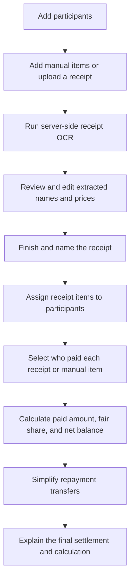
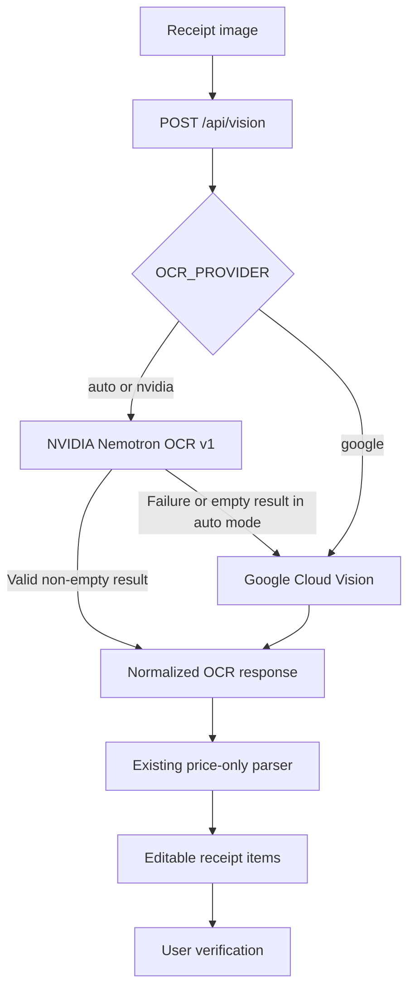

# DUTCHIE

DUTCHIE is an AI-assisted group-expense settlement web application. It turns receipt images and manually entered expenses into editable items, lets a group decide who shared each cost and who paid, then produces a simplified set of repayment transfers.

The product is designed around a practical constraint: receipt OCR is never perfect. DUTCHIE combines multi-provider OCR with human review instead of treating extracted values as unquestionable. Every receipt-derived item name and price can be corrected before it enters the settlement flow.

**Live demo:** [dutchie-505375468841.asia-northeast3.run.app](https://dutchie-505375468841.asia-northeast3.run.app/)

**Prototype:** [Google Slides](https://docs.google.com/presentation/d/1lBoc5AYGI8r5uN91CG3Umajn36QXNOVDilZIWVDKwnA/edit?usp=sharing)

## What DUTCHIE Does

DUTCHIE helps a group answer five questions:

1. What expenses are we splitting?
2. Who was responsible for each receipt item?
3. Who paid each item or receipt?
4. Who needs to send money to whom?
5. Why does each person owe or receive that amount?

It supports receipt-assisted entry and manual entry, while keeping the final decision with the user.

## Product Workflow



## Main Features

- Add and edit group participants.
- Add expenses manually or upload JPEG/PNG receipts.
- Use NVIDIA Nemotron OCR v1 with Google Cloud Vision fallback.
- Keep OCR provider credentials exclusively on the server.
- Review and edit receipt-derived item names and prices.
- Preserve tax as a receipt expense when it is recognized.
- Group completed items under a user-editable receipt name.
- Assign each receipt item to one or more participants.
- Split manual items equally across the group.
- Select the payer for each completed receipt and manual item.
- Calculate each participant's paid amount, fair share, and net balance.
- Simplify the repayment path with the existing debtor-to-creditor settlement routine.
- Show final transfers as plain-language instructions.
- Compare raw reimbursement paths with the simplified result.
- Preserve detailed calculation matrices behind an optional disclosure.
- Support phone, tablet, and desktop layouts without adding a UI framework.

## Receipt Intelligence

DUTCHIE uses a stateless, server-side OCR provider abstraction. The browser sends the current receipt image to `POST /api/vision`; the route validates the upload, invokes the configured provider, and returns normalized OCR text and word positions.



### Provider behavior

| Mode | Behavior |
| --- | --- |
| `auto` | Try NVIDIA first; use Google Vision if NVIDIA fails or returns no text. |
| `nvidia` | Use NVIDIA only and surface a sanitized failure if it is unavailable. |
| `google` | Use Google Vision only. NVIDIA configuration is not required. |

Missing or invalid `OCR_PROVIDER` values safely default to `auto`.

### What OCR does and does not do

The provider layer recognizes document text and word geometry. Its output still enters DUTCHIE's existing client-side price parser. The application does not currently perform semantic item-description extraction, merchant-specific parsing, or guaranteed subtotal reconciliation.

Extracted prices initially receive generated names such as `r1-1` and `r1-2`. Users can rename items, correct prices, name the receipt, and remove incorrect items before continuing.

Receipt images are processed only for the current request. DUTCHIE does not intentionally persist receipt images, log image bytes, or expose raw provider errors to the client.

## Settlement and Explainability

DUTCHIE derives each participant's balance from the existing calculation relationship:

```text
Amount paid - Fair share = Net balance
```

- A positive balance means the participant should receive money.
- A negative balance means the participant owes money.
- A near-zero balance means the participant is settled.

The final explanation page presents:

1. total group expense and settlement readiness;
2. final sender-to-receiver instructions;
3. paid amount, fair share, and net balance for each participant;
4. raw versus simplified transfer paths;
5. a plain-language calculation method;
6. detailed payer tables and matrices for optional inspection.

The explanations are deterministic and calculation-based. No external AI model writes settlement explanations, and the application does not claim that its current transfer routine always finds a globally minimal solution.

## Architecture

DUTCHIE is a Next.js App Router application deployed as a container on Google Cloud Run.

```text
app/
├── add_ppl/                 Participant entry
├── add_item/                Manual items, receipt upload, OCR review
├── split/                   Receipt-item responsibility assignment
├── payment/                 Receipt and manual-item payer selection
├── result/                  Fair-share overview
├── dutchie/                 Simplified settlement result
├── hdiw/                    Human-readable calculation explanation
├── api/vision/              Stateless server-side OCR route
└── store.tsx                In-memory client-side application state

lib/
├── ocr/                     OCR provider contract, NVIDIA, Google, selection
└── settlement-explainability.ts
                             Deterministic presentation view models and checks

tests/
├── ocr-providers.test.ts
└── settlement-explainability.test.ts

docs/
├── OCR_PROVIDER_ARCHITECTURE.md
├── RESPONSIVE_UI_AUDIT.md
└── SETTLEMENT_EXPLAINABILITY.md
```

### Technology stack

- Next.js 16 App Router
- React 19
- TypeScript
- Next.js Route Handlers
- NVIDIA Nemotron OCR v1
- Google Cloud Vision
- Docker
- Google Cloud Build
- Google Cloud Run
- Node test runner with `tsx`

Application state is held in the existing client-side store. DUTCHIE intentionally has no database, authentication system, expense history, or receipt-image persistence.

## Local Development

### Prerequisites

- Node.js 20 or later
- npm
- NVIDIA API access for NVIDIA OCR, and/or Google Application Default Credentials for Google Vision

### Install and run

```bash
npm ci
npm run dev
```

Open [http://localhost:3000](http://localhost:3000).

## Environment Configuration

Create a local `.env.local` file when using NVIDIA OCR:

```dotenv
OCR_PROVIDER=auto
NVIDIA_OCR_ENDPOINT=https://ai.api.nvidia.com/v1/cv/nvidia/nemotron-ocr-v1
NVIDIA_API_KEY=your_server_side_key
```

Google Vision uses Application Default Credentials through `new vision.ImageAnnotatorClient()`. DUTCHIE does not require a Google JSON key in the repository.

For local Google authentication:

```bash
gcloud auth application-default login
```

Never commit `.env`, `.env.local`, NVIDIA API keys, or service-account credentials.

## Cloud Run Deployment

The GitHub repository contains source code, not production secrets. Configure these values on the Cloud Run service:

```text
OCR_PROVIDER
NVIDIA_OCR_ENDPOINT
NVIDIA_API_KEY
```

Store `NVIDIA_API_KEY` in Google Secret Manager and expose it to the Cloud Run revision as an environment variable. `NVIDIA_OCR_ENDPOINT` and `OCR_PROVIDER` can be regular Cloud Run environment variables. The Cloud Run service account supplies Google ADC for the fallback provider and must have the required Google Vision and Secret Manager permissions.

Do not add production secrets to the Docker image, source code, GitHub repository, or build logs.

## Validation

Run the focused tests, lint, and production build with:

```bash
npm run test
npm run lint
npm run build
```

The automated tests cover:

- OCR provider selection and fallback behavior;
- sanitized dual-provider failure handling;
- NVIDIA and Google response normalization;
- participant receives, owes, and settled states;
- human-readable transfer and balance explanations;
- currency rounding;
- raw and simplified transfer equivalence checks;
- matrix direction and value preservation;
- non-mutating view-model construction.

The repository currently contains pre-existing ESLint issues in older page code, primarily explicit `any` usage. The production build and automated tests are the current functional validation gates while that lint debt remains documented.

## Responsive Design

The application is designed for the following viewport widths:

```text
320px  375px  390px  430px  768px  1024px  1280px
```

Major sections stack on narrow screens, fixed navigation controls reserve safe space, long names wrap, receipt previews preserve their aspect ratio, and calculation matrices scroll inside their own containers instead of creating page-level overflow.

## Current Limitations

- OCR accuracy varies with blur, lighting, perspective, receipt typography, language, and provider availability.
- Receipt parsing currently focuses on prices and tax rather than reliable semantic product descriptions.
- Human review is still required before settlement.
- Google fallback requires correctly configured Cloud Run permissions or local ADC.
- NVIDIA availability, quotas, latency, and pricing depend on the configured endpoint and account.
- Currency is currently displayed in USD.
- State is intentionally in-memory and is lost when the application is refreshed.
- The settlement routine simplifies repayment relationships but is not presented as a proof of global minimum transfer count.

## Documentation

- [OCR provider architecture](docs/OCR_PROVIDER_ARCHITECTURE.md)
- [Settlement explainability](docs/SETTLEMENT_EXPLAINABILITY.md)
- [Responsive UI audit](docs/RESPONSIVE_UI_AUDIT.md)

## Project Positioning

DUTCHIE is a portfolio project demonstrating AI-assisted receipt understanding, multi-provider document processing, human-in-the-loop correction, responsive product design, deterministic settlement logic, and calculation explainability.

It does not train its own AI model. NVIDIA Nemotron OCR and Google Cloud Vision provide document recognition, while DUTCHIE owns the review workflow, expense assignment, settlement calculation, transfer presentation, and trust-oriented explanation layer.
